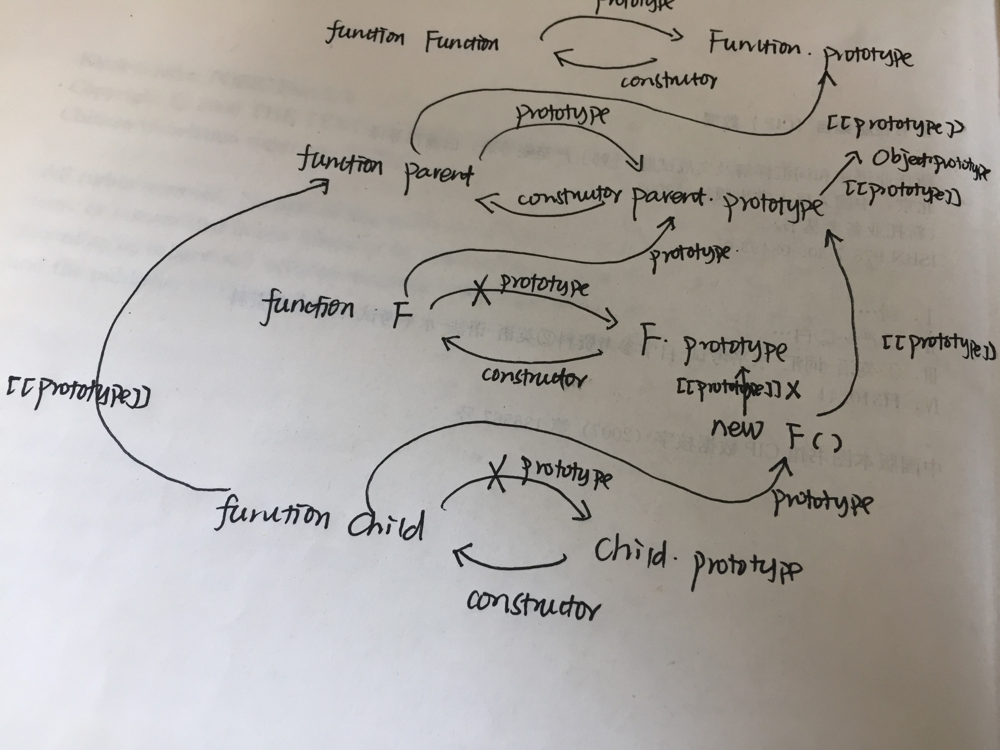

#### 1.我们首先看看通过babel编译后几个通用函数

##### 1.1 首先是_createClass方法：
```js
var _createClass = function () { 
    function defineProperties(target, props) { 
        for (var i = 0; i < props.length; i++) {
         var descriptor = props[i];
         //属性
          descriptor.enumerable = descriptor.enumerable || false; 
          descriptor.configurable = true; 
          //enumerable,configurable设置
          if ("value" in descriptor) descriptor.writable = true;
          //如果有value那么可写
           Object.defineProperty(target, descriptor.key, descriptor); 
           //调用defineProperty
        } 
    } 
    return function (Constructor, protoProps, staticProps) { 
        if (protoProps) defineProperties(Constructor.prototype, protoProps); 
        //设置到第一个class的prototype中
        if (staticProps) defineProperties(Constructor, staticProps); 
        //设置static类型属性
        return Constructor; }; 
    }();
```
首先该方法是一个自执行函数，接收的第一个参数是用来被修改prototype的构造函数，第二个参数是为第一个构造函数的原型对象需要添加的方法或者属性，第三个参数是需要为第一个构造函数添加的静态属性对象。我们给出一个例子，下面是一个class实例：

```js
class Parent {
    name = "qck";
    sex = "male";
    //实例变量
    sayHello(name){
        console.log('qck said Hello!',name);
    }
    constructor(location){
      this.location = location;
    }
}
```
我们看看编译后的结果是如何调用_createClass的:
```js
//这里是自执行函数
var Parent = function () {
    _createClass(Parent, [{
        key: "sayHello",
        //Parent的实例方法，通过修改Parent.prototype来完成
        value: function sayHello(name) {
            console.log('qck say Hello!', name);
        }
    }]);
     //在Parent.prototype中添加原型属性
    function Parent(location) {
        _classCallCheck(this, Parent);
        this.name = "qck";
        this.sex = "male";
        this.location = location;
    }
    return Parent;
}();
```
此时你应该可以理解了：我们的class上的方法其实是通过修改该类(实际上是函数)的prototype来完成的。但是我们的实例属性还是通过构造函数方式来完成的。

##### 1.2 然后是_classCallCheck方法
```js
function _classCallCheck(instance, Constructor) {
     if (!(instance instanceof Constructor)) {
      throw new TypeError("Cannot call a class as a function"); 
    } 
}
```
通过下面的调用：
```js
    _classCallCheck(this, Parent);
```
你可以清楚的知道，该方法的作用就是为了保证我们的实例对象是特定的类型。

##### 1.3 下面是我们的继承实现
```js
class Child extends Parent{
    name ='qinliang';
    sex = "male";
    static hobby = "pingpong";
    //static variable
    constructor(location){
        super(location);
    }
    sayHello (name){
    //super调用父类方法
        super.sayHello(name);
    }
}
```
此时我们看看通过babel编译后的结果是什么:

第一步：看看继承的通用方法_inherit:
```js
function _inherits(subClass, superClass) { 
    if (typeof superClass !== "function" && superClass !== null) { 
        throw new TypeError("Super expression must either be null or a function, not " + typeof superClass); 
    } 
    //SuperClass必须是一个函数，同时非null
  subClass.prototype = Object.create(superClass && superClass.prototype, { 
       constructor: { value: subClass, enumerable: false, writable: true, configurable: true }
    });
  //原型上的方法/属性全部被继承过来了
  if (superClass) 
    Object.setPrototypeOf ? Object.setPrototypeOf(subClass, superClass) : subClass.__proto__ = superClass; 
}
```
其实这里就是我们平时使用的寄生式组合继承，我们看看下面的内存图：



到这里你应该就能明白了！[这里指出的四个例子](http://cnodejs.org/topic/55bb47b2f36f579657fc54ae)应该就是很容易理解了！即下面的例子:
```js
'use strict';
class A { 
}
class B extends A  {
}
console.log(B.__proto__ === A); // true  第1行
console.log(B.prototype.__proto__ === A.prototype); // true 第2行
console.log(A.__proto__ === Function.prototype); // true 第3行
console.log(A.prototype.__proto__ === Object.prototype); // true 第4行
```
第二步：重点是静态变量的继承实现
```js
 if (superClass) 
    Object.setPrototypeOf ? Object.setPrototypeOf(subClass, superClass) : subClass.__proto__ = superClass; 
```
估计有很多人并不明白这句话的目的。其实他是为了实现类中静态变量的继承而设计的，如下面的例子：
```js
class Parent {
    static hobby = "majiang";   
}
class Child extends Parent{
    static hobby = "pingpong";
}
```
此时你访问Child.hobby就会得到"pingpong"，但是如果修改为如下：
```js
class Parent {
    static hobby = "majiang";   
}
class Child extends Parent{
    // static hobby = "pingpong";
}
```
此时你访问Child.hobby就获得"majiang"！不用我说你应该也能理解，因为Child中并没有hobby属性，所以会沿着原型链来访问，而我们的Child.__proto__=Parent，所以就能直接继承了父类的静态变量了。但是，你刚才也看到了，如果子类有同名的静态变量就会覆盖掉父类的静态变量，这是由于原型链的固有属性导致的!接下来我们看一下其他的通用方法：

##### 1.4 看看__get方法
我们先看看__get是如何调用的：
```js
//Child也是自执行函数
var Child = function (_Parent) {
    _inherits(Child, _Parent);
    //static variable
    function Child(location) {
        _classCallCheck(this, Child);
        var _this = _possibleConstructorReturn(this, (Child.__proto__ || Object.getPrototypeOf(Child)).call(this, location));
         //父类的this或者子类自己的this
        _this.name = 'qinliang';
        _this.sex = "male";
        return _this;
    }
    //更新Child类型的原型
    _createClass(Child, [{
        key: "sayHello",
        value: function sayHello(name) {
            //super调用父类方法
            _get(Child.prototype.__proto__ || Object.getPrototypeOf(Child.prototype), "sayHello", this).call(this, name);
         //将调用子类的sayHello时候传入的参数传到父类中
        }
    }]);
    return Child;
}(Parent);
```
也就是说调用Child的原型上的sayHello之前会获取Parent原型(Child.prototype.__proto__，参见原型图理解)上的同名方法
```js
var _get = function get(object, property, receiver) {
 if (object === null) object = Function.prototype; 
 //默认从Function.prototype中获取方法
 var desc = Object.getOwnPropertyDescriptor(object, property); 
 //获取父类原型链中的指定方法
 if (desc === undefined) {
  var parent = Object.getPrototypeOf(object);
  //继续网上获取父类原型
   if (parent === null) { 
        return undefined; 
   } else { 
        return get(parent, property, receiver); 
        //继续获取父类原型中指定的方法
    }
  } else if ("value" in desc) { 
    return desc.value; 
    //返回获取到的值
  } else { 
    var getter = desc.get;
    //获取原型的getter方法，接着调用getter方法，并传入this对象
     if (getter === undefined) { 
        return undefined; 
     } return getter.call(receiver); 
    } 
 };
```
不要我说，你应该理解了下面这句话:
```js
_get(Child.prototype.__proto__ || Object.getPrototypeOf(Child.prototype), "sayHello", this).call(this, name);
```
即调用子类的方法之前会先调用父类的方法，因为我们在子类中明确通过super来调用了父类的sayHello方法!

##### 1.5 _possibleConstructorReturn方法
我们先看下自己调用的代码：
```js
  constructor(location){
    super(location);
  }
```
也就是说我们是在子类的构造函数中调用父类的构造函数，下面是编译的结果：
```js
var Child = function (_Parent) {
  _inherits(Child, _Parent);
  //static variable
  function Child(location) {
    _classCallCheck(this, Child);
    var _this = _possibleConstructorReturn(this, (Child.__proto__ || Object.getPrototypeOf(Child)).call(this, location));
    //父类的this或者子类自己的this
    _this.name = 'qinliang';
    _this.sex = "male";
    return _this;
  }
  //更新Child类型的原型
  _createClass(Child, [{
    key: "sayHello",
    value: function sayHello(name) {
      //super调用父类方法,super.sayHello
      _get(Child.prototype.__proto__ || Object.getPrototypeOf(Child.prototype), "sayHello", this).call(this, name);
     //将调用子类的sayHello时候传入的参数传到父类中
    }
  }]);
  return Child;
}(Parent);
```
重点是下面的部分：
```js
 function Child(location) {
    _classCallCheck(this, Child);
    //检测this指向问题
    var _this = _possibleConstructorReturn(this, (Child.__proto__ || Object.getPrototypeOf(Child)).call(this, location));
    //根据subClass.__proto__ = superClass或者内存图你可以明确的看到第二个参数就是我们的父类的构造函数！！！
    _this.name = 'qinliang';
    _this.sex = "male";
    return _this;
  }
```
所以，这里你很容易就知道了，我们其实是调用父类的构造函数而已，并传入子类调用时候的参数。我们看看该方法的具体代码：
```js
//第一个参数为子类的this
//第二个参数为父类的构造函数
function _possibleConstructorReturn(self, call) { 
  if (!self) { 
        throw new ReferenceError("this hasn't been initialised - super() hasn't been called");
   } 
  return call && (typeof call === "object" || typeof call === "function") ? call : self; 
}
```
很显然，如果父类的构造函数存在那么返回父类的构造函数。


#### 2.可能抛出的常见错误以及原因

##### 2.1 父类要么不存在要么必须是一个函数

```js
  if (typeof superClass !== "function" && superClass !== null) { 
    //父类要么是null要么是一个函数
    throw new TypeError("Super expression must either be null or a function, not " + typeof superClass); 
  } 
```
要实现继承，那么父类必须存在而且是一个函数(其他对象都是不可以的)或者是null。其出现在_inherits方法中

##### 2.2 将一个class作为函数来调用了无法保证this正确指向
```js
function _classCallCheck(instance, Constructor) {
   if (!(instance instanceof Constructor)) {
    //实例化的时候instance必须是一个指定类型
    throw new TypeError("Cannot call a class as a function"); 
  } 
}
```
下面的代码就会抛出这个错误：
```js
class A { 
}
class B extends A  {
  constructor(name){
    super(name);
    this.name =name;
  }
}
console.log(B("liangklfangl"));
```
因为B是一个class类型，在B函数内部会做check如下:
```js
function Parent(location) {
    _classCallCheck(this, Parent);
    this.name = "qck";
    this.sex = "male";
    this.location = location;
  }
```
因为我们直接调用了B函数，所以this为undefined，所以_classCallCheck抛出错误。该错误表示我们直接调用了该函数，而不是new一个对象，如new Parent()等导致this指向存在问题！

##### 2.3 当super调用的父类方法不存在时候报错
```js
function A(){
}
class B extends A  {
  constructor(name){
     super();
  }
  sayName(){
    super.sayName();
  }
}
new B("liangklfangl").sayName()
```
此时报错：ncaught TypeError: Cannot read property 'call' of undefined

##### 2.4未遇到的错误
```js
function _possibleConstructorReturn(self, call) { 
  if (!self) { 
        throw new ReferenceError("this hasn't been initialised - super() hasn't been called");
   } 
  return call && (typeof call === "object" || typeof call === "function") ? call : self; 
}
```
说实话，目前该错误我没有遇到过，如果有人遇到过烦劳issue，我自己如果遇到也会自动更新。其调用来自于：
```js
function Child(location) {
    _classCallCheck(this, Child);
    //表明这一步this也是Child类型被成功判断new Child()
    var _this = _possibleConstructorReturn(this, (Child.__proto__ || Object.getPrototypeOf(Child)).call(this, location));
         //父类的this或者子类自己的this
    _this.name = 'qinliang';
    _this.sex = "male";
    return _this;
  }
```
第一个_classCallCheck保证了该this是指定的类型，那么其肯定不是Null了，所以接下来这个_possibleConstructorReturn用来返回父类的构造函数然后调用，那么此时的this的布尔值应该不可能是false了，所以我个人认为该错误不会抛出(烦请指正)。

